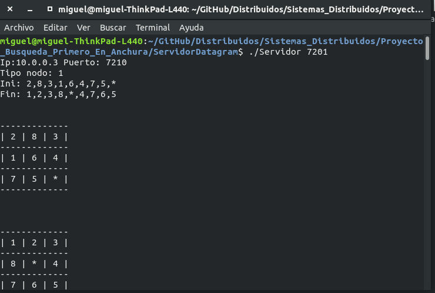
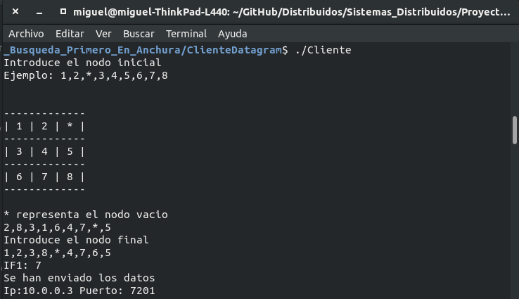

Ejemplo de aplicación del algoritmo de busqueda primero en anchura para encontrar la 
solucción de un puzzle de 3 x 3. 

**Compilar:**
        make

**Limpiar:**
        make clean

**Ejecución del Servidor**
	./Servidor [Puerto]
**Ejecución del Cliente**
	./Cliente 

Ejemplo de ejecución

