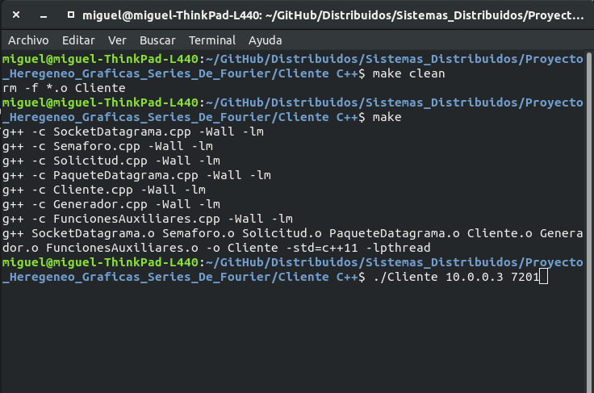
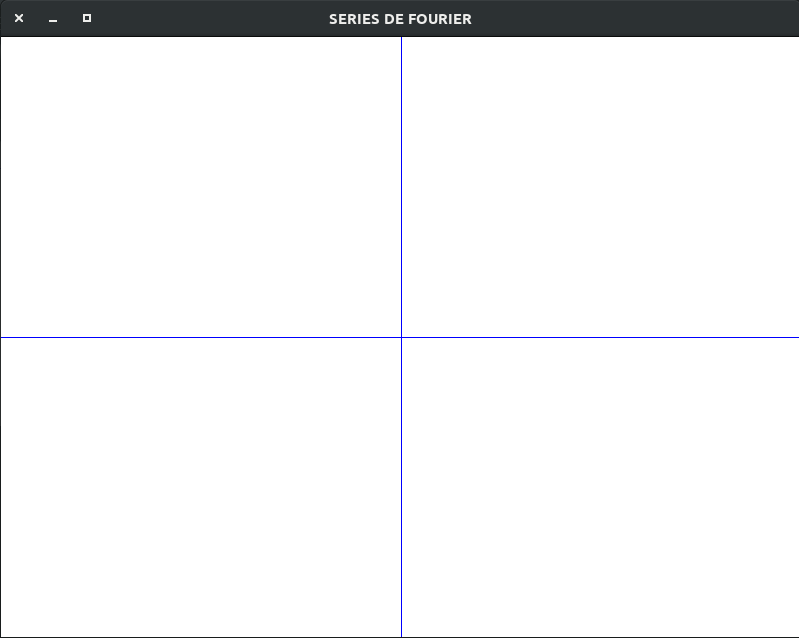

Servidor de gráficos en JAVA que se encarga de graficar las coordenadas recibidas por datagramas
UDP utilizando un potrocolo seguro contra perdidas de mensages.

Generador de coordenadas de Series de Fourier en C++.

**Compilar Cliente:**
        make

**Ejecución del Servidor**
	Proyecto en NetBeans

**Ejecución del Cliente**
	./Cliente [ip] [puerto]

Ejemplo de ejecución

.png)

.png)

